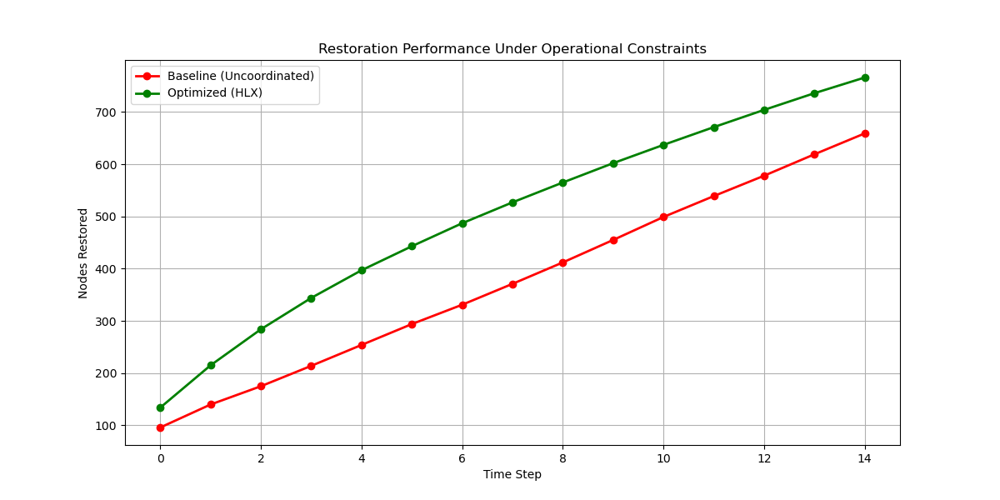
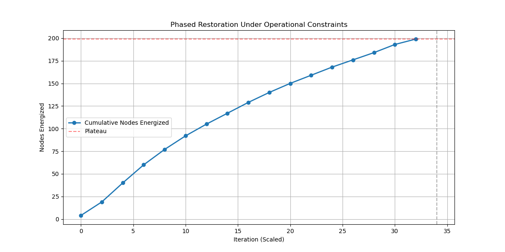

# HLX Grid Restoration Demo

A demonstration of constraint-aware grid restoration under outage conditions.

This project compares baseline restoration behavior with an optimized, distributed restoration strategy that improves recovery outcomes while respecting operational limits.

> Constraint-aware restoration engine demonstration for power grid recovery under operational limits.
---

## ⚡ Core Result

- Consistent improvement in nodes restored under identical constraints  
- Capacity-aware restoration (no overload or unrealistic propagation)  
- Deterministic, reproducible behavior  

---

## 🔥 Demo 1 — Restoration Performance

Simulates a large-scale outage and compares:

- Baseline (uncoordinated restoration)  
- Optimized (HLX-driven restoration)  

### Example Output

```

Baseline Restored: 659
Optimized Restored: 766
Improvement: +16.24%

```

### What it shows

- Both systems operate under identical constraints  
- Optimized restoration uses available capacity more efficiently  
- Recovery improvement emerges from coordination, not additional resources  

---

## 🧠 Demo 2 — Phased Restoration Behavior

Models how restoration progresses under real operational constraints.

### Observed Behavior

- Rapid early recovery  
- Controlled ramp under capacity limits  
- Natural slowdown and plateau  
- Identification of restoration boundary  

### Example Output

```

Nodes Restored: 199/200
Percent Restored: 99.50%

⚠ Plateau detected:
Remaining nodes require intervention (topology repair or control recovery)

````

### What it shows

- Restoration is not unlimited  
- System detects when automated recovery reaches its limit  
- Remaining recovery requires targeted intervention  

---

## 📊 Example Visuals





---

## ▶ Run Demo

```bash
pip install -r requirements.txt
python yuri_demo.py
python orchestrator_demo.py
````

---

## 🧭 What This Is

* A demonstration of restoration behavior
* A comparison of decision strategies under constraints
* A system-level model of grid recovery dynamics

---

## ⚠ Notes

* This repository contains demonstration logic only
* Internal decision engine and optimization layers are abstracted
* Results are deterministic and reproducible

---

## 🔗 Related Systems

* HLX Delta — data reduction and state reconstruction
* HLX Adam — structure-conditioned optimization
* HLX Photo — deterministic reconstruction systems

---

## 🏢 By

Evo Engineering LLC

`````
